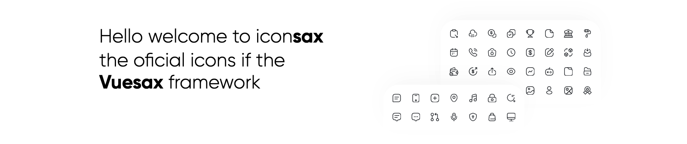
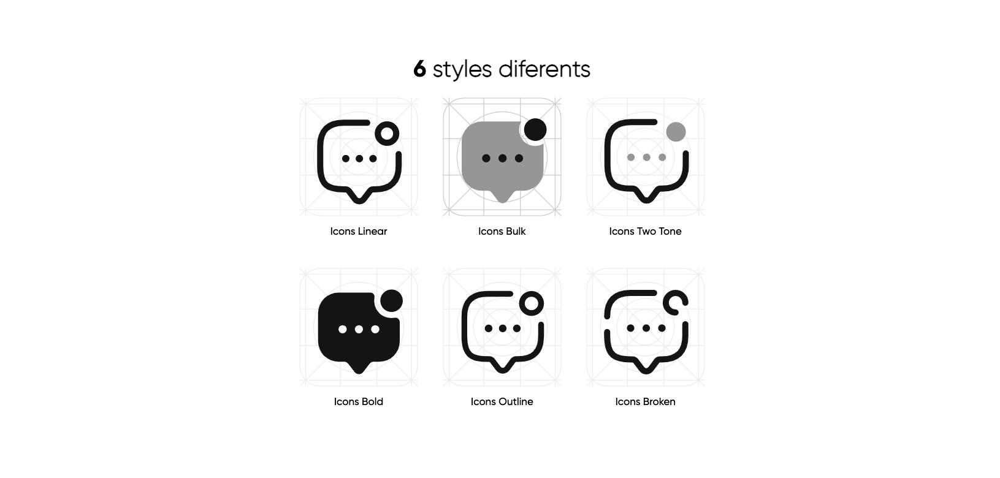
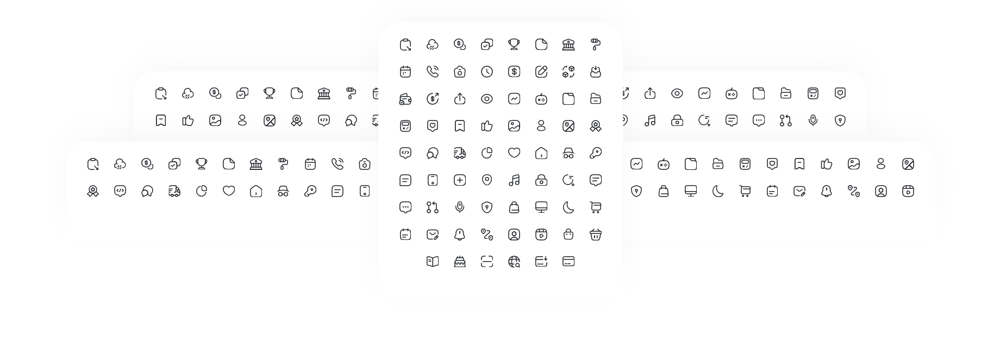

# flutter_iconsax

Fork of https://github.com/luisDanielRoviraContreras/flutter_iconsax

Organise icons and add cheat sheet. Please let me know if any are mislabelled.

[Iconsax](https://iconsax.io/) for Flutter
